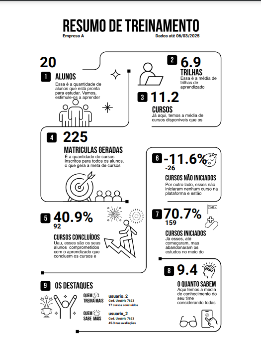

# Analise de Dados com envio automatico

Este script automatiza a geração de relatórios semanais, contendo informações calculadas a partir de dados em um arquivo Excel, e realiza três funções principais:

1. Processamento de Dados: Leitura e cálculo de métricas detalhadas.
   
2. Geração de PDF com Template: Criação de um PDF personalizado usando um
template visual.

3. Envio de E-mail com Anexo: Envio do PDF gerado para o destinatário especificado
via e-mail.

## 🔨 Dependências

O código utiliza as seguintes bibliotecas:

`pandas:` Para manipulação e análise dos dados do arquivo Excel.

`reportlab?` Para geração de PDFs com layouts customizados.

`smtplib e email.mime:` Para envio de e-mails com anexos.

`io:` Manipulação de fluxos de dados em memória.

`datetime:` Manipulação de datas e horas.

## ✔️ Técnicas e tecnologias utilizadas

`Python`: Linguagem de programação utilizada para desenvolver a lógica.

## 🛠️ Abrir e rodar o projeto

Baixar e instalar a versão mais recente do Python em: [download](https://www.python.org/downloads/).

Necessário fazer a instalação de todas as dependências.

Para executar o projeto, você deve:
1. Adcionar um Template em `template_path = r"Caminho\Do\Template\Fundo"`

2. Adcionar uma Fonte de preferência Roboto em: `roboto_bold_path = r"Caminho\Fonte\Roboto"`

3. Adcionar um arquivo Excel contendo os dados em: `arquivo_excel = r"Caminho\Arquivo\Excel"`

## 📷 Exemplo:

